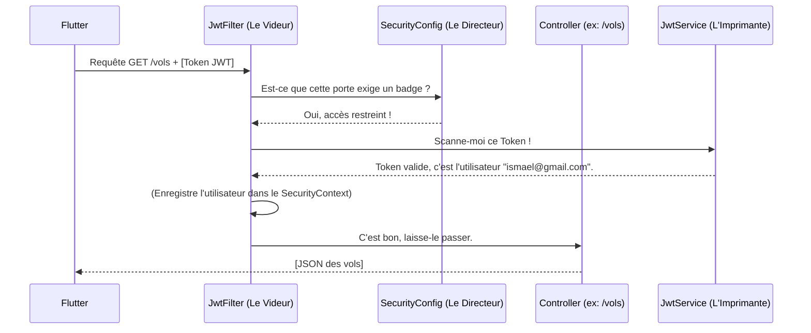

# La Carte d'Architecture de Spring Security (JWT)

Quand on développe une API sécurisée, il y a 5 fichiers clés. Voici le rôle exact de chacun d'eux, expliqué de manière simple.

---

## 1. `Utilisateur.java` (Le Client)
*   **Ce qu'il fait :** C'est la classe Entité qui représente la personne physique dans la base de données.
*   **La touche Sécurité :** En ajoutant `implements UserDetails`, on permet à ce client de parler la même langue que le système de sécurité de Spring. Spring peut ainsi lui demander : *"Es-tu bloqué ?"*, *"Quel est ton mot de passe crypté ?"*.

## 2. `JwtService.java` (L'Imprimante à Badges)
*   **Ce qu'il fait :** C'est une simple "boîte à outils" (un utilitaire). Elle ne prend aucune décision métier.
*   **La touche Sécurité :** 
    *   Si on lui donne les infos d'un Client, elle imprime un Token (le Badge VIP) signé avec une Clé Secrète.
    *   Si on lui donne un Token, elle le scanne, vérifie la signature, et lit l'email écrit dessus.

## 3. `JwtAuthenticationFilter.java` (Le Videur à la porte)
*   **Ce qu'il fait :** C'est le bras armé du système. Il se tient physiquement devant TOUTES les portes de votre API (devant vos Controllers).
*   **La touche Sécurité :** Chaque fois que Flutter envoie une requête, ce filtre l'arrête. Il fouille les entêtes HTTP (`Authorization`). S'il trouve un Token, il le donne à l'Imprimante (`JwtService`) pour le scanner. Si le scan est valide, il ouvre la porte vers le Controller demandé.

## 4. `SecurityConfig.java` (Le Directeur de l'Hôtel)
*   **Ce qu'il fait :** Le Videur est bête, il applique les règles bêtement. Ce fichier donne les règles.
*   **La touche Sécurité :** C'est ici qu'on écrit les ordres : *"Laisse la porte `/login` et `/inscription` grandes ouvertes, n'exige pas de badge pour ça. Par contre, pour `/vols`, sois intraitable, pas de badge = pas d'entrée (Erreur 403 Forbidden) !"*

## 5. `AuthController.java` (La Réception)
*   **Ce qu'il fait :** C'est un contrôleur classique, comme tous ceux que vous avez déjà faits.
*   **La touche Sécurité :** C'est le guichet unique. Flutter y envoie l'Email et le Mot de passe en clair pour la toute première fois. La Réception vérifie dans MySQL avec `BCrypt`. Si c'est bon, elle utilise l'Imprimante à Badges (`JwtService`) pour créer un Token et le renvoie au téléphone !

---

## 🔄 Le Schéma du Cheminement (Le Workflow)

Voici comment ces 5 éléments interagissent quand Flutter fait une requête :

